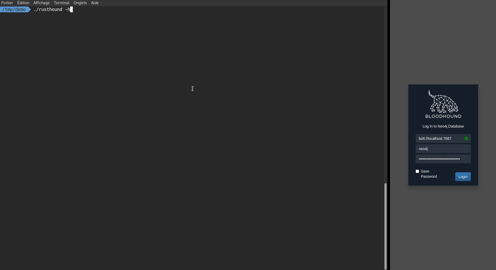
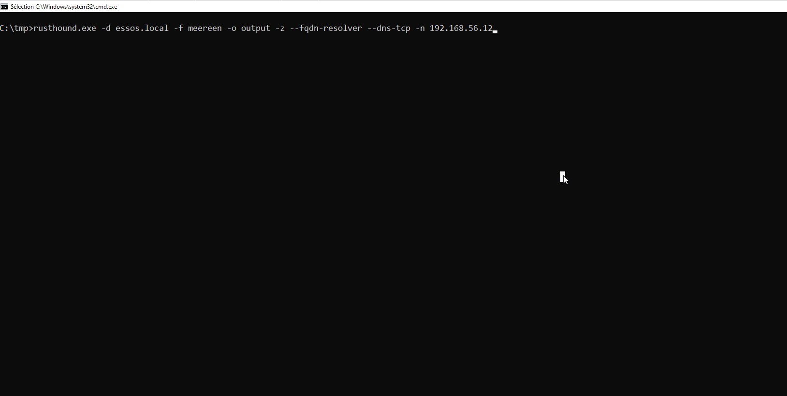
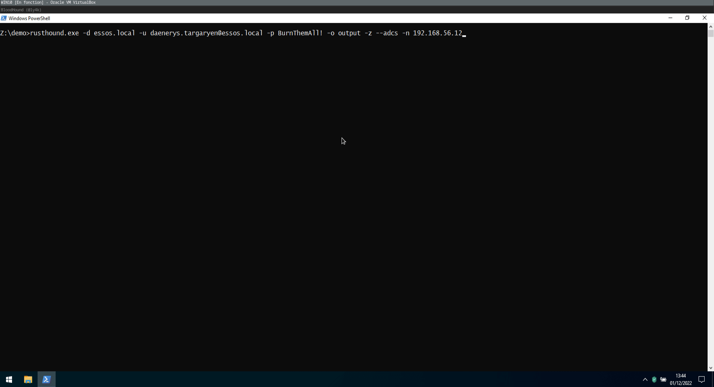

> :warning: *This version is only compatible with [BloodHound Legacy 4.x](https://github.com/BloodHoundAD/BloodHound)*

> [BloodHound Community Edition (CE)](https://github.com/SpecterOps/BloodHound) version will be publish in [v2](https://github.com/NH-RED-TEAM/RustHound/tree/v2) branch.

<p align="center">

</p>


<p align="center">
  <a href="https://crates.io/crates/rusthound"></a>
  
  <a href="https://twitter.com/intent/follow?screen_name=OPENCYBER_FR" title="Follow" rel="nofollow"></a>
  <a href="https://twitter.com/intent/follow?screen_name=g0h4n_0" title="Follow" rel="nofollow"></a>
  <br>
  
  
  

  <br>
</p>

# Summary

- [Limitation](#limitations)
- [Description](#description)
- [How to compile it?](#how-to-compile-it)
  - [Using Makefile](#using-makefile)
  - [Using Dockerfile](#using-dockerfile)
  - [Using Cargo](#using-cargo)
  - [Linux x86_64 static version](#manually-for-linux-x86_64-static-version)
  - [Windows static version from Linux](#manually-for-windows-static-version-from-linux)
  - [macOS static version from Linux](#manually-for-macos-static-version-from-linux)
  - [Optimize the binary size](#optimize-the-binary-size)

- [How to build documentation?](#how-to-build-documentation)
- [Usage](#usage)
- [Demo](#demo)
  - [Simple usage](#simple-usage)
  - [Module FQDN resolver](#module-fqdn-resolver)
  - [Module ADCS collector](#module-adcs-collector)
- [Statistics](#rocket-statistics)
- [Roadmap](#-roadmap)
- [Links](#link-links)

# Limitations

Not all SharpHound features have been implemented. Some exist in RustHound and not in SharpHound or BloodHound-Python. Please refer to the [roadmap](#-roadmap) for more information.

# Description

RustHound is a **cross-platform** BloodHound collector tool written in Rust, making it compatible with Linux, Windows, and macOS.

No AV detection and **cross-compiled**.

RustHound generates users, groups, computers, OUs, GPOs, containers, and domain JSON files that can be analyzed with BloodHound.

> 💡 If you can use SharpHound, use it.
> Use RustHound as a backup solution if SharpHound is detected by AV or if it not compatible with your OS.


# How to compile it?

## Using Makefile

You can use the **make** command to install RustHound or to compile it for Linux or Windows.

```bash
make install
rusthound -h
```

More command in the **Makefile**:

```bash
Default:
usage: make install
usage: make uninstall
usage: make debug
usage: make release

Static:
usage: make windows
usage: make windows_x64
usage: make windows_x86
usage: make linux_aarch64
usage: make linux_x86_64
usage: make linux_musl
usage: make macos
usage: make arm_musl
usage: make armv7

Without cli argument:
usage: make windows_noargs

Dependencies:
usage: make install_windows_deps
usage: make install_linux_musl_deps
usage: make install_macos_deps
```

## Using Dockerfile

Use RustHound with Docker to make sure to have all dependencies.

```bash
docker build --rm -t rusthound .

# Then
docker run --rm -v ./:/usr/src/rusthound rusthound windows
docker run --rm -v ./:/usr/src/rusthound rusthound linux_musl
docker run --rm -v ./:/usr/src/rusthound rusthound macos
```

## Using Cargo

You will need to install Rust on your system.

[https://www.rust-lang.org/fr/tools/install](https://www.rust-lang.org/fr/tools/install)

RustHound supports Kerberos and GSSAPI. Therefore, it requires Clang and its development libraries, as well as the Kerberos development libraries. On Debian and Ubuntu, this means **clang-N**, **libclang-N-dev**, and **libkrb5-dev**.

For example:
```bash
# Debian/Ubuntu
sudo apt-get -y update && sudo apt-get -y install gcc clang libclang-dev libgssapi-krb5-2 libkrb5-dev libsasl2-modules-gssapi-mit musl-tools gcc-mingw-w64-x86-64
```

Here is how to compile the "release" and "debug" versions using the **cargo** command.

```bash
git clone https://github.com/OPENCYBER-FR/RustHound
cd RustHound
cargo build --release
# or debug version
cargo b
```

The result can be found in the target/release or target/debug folder.

Below you can find the compilation methodology for each of the OS from Linux.
If you need another compilation system, please consult the list in this link: [https://doc.rust-lang.org/nightly/rustc/platform-support.html](https://doc.rust-lang.org/nightly/rustc/platform-support.html)


## Manually for Linux x86_64 static version

```bash
# Install rustup and Cargo for Linux
curl https://sh.rustup.rs -sSf | sh

# Add Linux deps
rustup install stable-x86_64-unknown-linux-gnu
rustup target add x86_64-unknown-linux-gnu

# Static compilation for Linux
git clone https://github.com/OPENCYBER-FR/RustHound
cd RustHound
CFLAGS="-lrt";LDFLAGS="-lrt";RUSTFLAGS='-C target-feature=+crt-static';cargo build --release --target x86_64-unknown-linux-gnu
```

The result can be found in the target/x86_64-unknown-linux-gnu/release folder.


## Manually for Windows static version from Linux
```bash
# Install rustup and Cargo in Linux
curl https://sh.rustup.rs -sSf | sh

# Add Windows deps
rustup install stable-x86_64-pc-windows-gnu
rustup target add x86_64-pc-windows-gnu

# Static compilation for Windows
git clone https://github.com/OPENCYBER-FR/RustHound
cd RustHound
RUSTFLAGS="-C target-feature=+crt-static" cargo build --release --target x86_64-pc-windows-gnu
```

The result can be found in the target/x86_64-pc-windows-gnu/release folder.


## Manually for macOS static version from Linux

Amazing documentation: [https://wapl.es/rust/2019/02/17/rust-cross-compile-linux-to-macos.html](https://wapl.es/rust/2019/02/17/rust-cross-compile-linux-to-macos.html)

```bash
# Install rustup and Cargo in Linux
curl https://sh.rustup.rs -sSf | sh

# Add macOS tool chain
sudo git clone https://github.com/tpoechtrager/osxcross /usr/local/bin/osxcross
sudo wget -P /usr/local/bin/osxcross/ -nc https://s3.dockerproject.org/darwin/v2/MacOSX10.10.sdk.tar.xz && sudo mv /usr/local/bin/osxcross/MacOSX10.10.sdk.tar.xz /usr/local/bin/osxcross/tarballs/
sudo UNATTENDED=yes OSX_VERSION_MIN=10.7 /usr/local/bin/osxcross/build.sh
sudo chmod 775 /usr/local/bin/osxcross/ -R
export PATH="/usr/local/bin/osxcross/target/bin:$PATH"

# Cargo needs to be told to use the correct linker for the x86_64-apple-darwin target, so add the following to your project’s .cargo/config file:
grep 'target.x86_64-apple-darwin' ~/.cargo/config || echo "[target.x86_64-apple-darwin]" >> ~/.cargo/config
grep 'linker = "x86_64-apple-darwin14-clang"' ~/.cargo/config || echo 'linker = "x86_64-apple-darwin14-clang"' >> ~/.cargo/config
grep 'ar = "x86_64-apple-darwin14-clang"' ~/.cargo/config || echo 'ar = "x86_64-apple-darwin14-clang"' >> ~/.cargo/config

# Static compilation for macOS
git clone https://github.com/OPENCYBER-FR/RustHound
cd RustHound
RUSTFLAGS="-C target-feature=+crt-static" cargo build --release --target x86_64-apple-darwin --features nogssapi
```

The result can be found in the target/x86_64-apple-darwin/release folder.


## Optimize the binary size

> 💡 To obtain an optimized compilation of RustHound add the following compilation parameters at the end of the `Cargo.toml` file.

```bash
[profile.release]
opt-level = "z"
lto = true
strip = true
codegen-units = 1
panic = "abort"
```

The size of the binary will be considerably minimized.
Basic cargo compiler commands can be used.

```bash
make windows
```

More information [here](https://github.com/johnthagen/min-sized-rust)


# How to build the documentation?

```bash
git clone https://github.com/OPENCYBER-FR/RustHound
cd RustHound
cargo doc --open --no-deps
```

# Usage

```bash
Usage: rusthound [OPTIONS] --domain <domain>

Options:
  -v...          Set the level of verbosity
  -h, --help     Print help information
  -V, --version  Print version information

REQUIRED VALUES:
  -d, --domain <domain>  Domain name like: DOMAIN.LOCAL

OPTIONAL VALUES:
  -u, --ldapusername <ldapusername>  LDAP username, like: user@domain.local
  -p, --ldappassword <ldappassword>  LDAP password
  -f, --ldapfqdn <ldapfqdn>          Domain Controler FQDN like: DC01.DOMAIN.LOCAL or just DC01
  -i, --ldapip <ldapip>              Domain Controller IP address like: 192.168.1.10
  -P, --ldapport <ldapport>          LDAP port [default: 389]
  -n, --name-server <name-server>    Alternative IP address name server to use for DNS queries
  -o, --output <output>              Output directory where you would like to save JSON files [default: ./]

OPTIONAL FLAGS:
      --ldaps           Force LDAPS using for request like: ldaps://DOMAIN.LOCAL/
      --dns-tcp         Use TCP instead of UDP for DNS queries
      --dc-only         Collects data only from the domain controller. Will not try to retrieve CA security/configuration or check for Web Enrollment
      --old-bloodhound  For ADCS only. Output result as BloodHound data for the original BloodHound version from @BloodHoundAD without PKI support
  -z, --zip             Compress the JSON files into a zip archive

OPTIONAL MODULES:
      --fqdn-resolver  Use fqdn-resolver module to get computers IP address
      --adcs           Use ADCS module to enumerate Certificate Templates, Certificate Authorities and other configurations.
                       (For the custom-built BloodHound version from @ly4k with PKI support)
```

# Demo

Examples are done on the [GOADv2](https://github.com/Orange-Cyberdefense/GOAD) implemented by [mayfly](https://twitter.com/M4yFly):

## Simple usage

```bash
# Linux with username:password
rusthound -d north.sevenkingdoms.local -u 'jeor.mormont@north.sevenkingdoms.local' -p '_L0ngCl@w_' -o /tmp/demo -z

# Linux with username:password and ldapip
rusthound -d north.sevenkingdoms.local -i 192.168.56.11 -u 'jeor.mormont@north.sevenkingdoms.local' -p '_L0ngCl@w_' -o /tmp/demo -z

# Linux with username:password and ldaps
rusthound -d north.sevenkingdoms.local --ldaps -u 'jeor.mormont@north.sevenkingdoms.local' -p '_L0ngCl@w_' -o /tmp/demo -z 
# Linux with username:password and ldaps and custom port
rusthound -d north.sevenkingdoms.local --ldaps -P 3636 -u 'jeor.mormont@north.sevenkingdoms.local' -p '_L0ngCl@w_' -o /tmp/demo -z 

# Tips to redirect and append both standard output and standard error to a file > /tmp/rh_output 2>&1
rusthound -d north.sevenkingdoms.local --ldaps -u 'jeor.mormont@north.sevenkingdoms.local' -p '_L0ngCl@w_' -o /tmp/demo --fqdn-resolver > /tmp/rh_output 2>&1

# Windows with GSSAPI session
rusthound.exe -d sevenkingdoms.local --ldapfqdn kingslanding
# Windows simple bind connection username:password (do not use single or double quotes with cmd.exe)
rusthound.exe -d sevenkingdoms.local -u jeor.mormont@north.sevenkingdoms.local -p _L0ngCl@w_ -o output -z

# Kerberos authentication (Linux)
export KRB5CCNAME="/tmp/jeor.mormont.ccache"
rusthound -d sevenkingdoms.local -f kingslanding -k -z
# Kerberos authentication (Windows)
rusthound.exe -d sevenkingdoms.local -f kingslanding -k -z
```
<p align="center">

</p>

## Module FQDN resolver

```bash
# Linux with username:password and FQDN resolver module
rusthound -d essos.local -u 'daenerys.targaryen@essos.local' -p 'BurnThemAll!' -o /tmp/demo --fqdn-resolver -z
# Linux with username:password and ldaps and FQDN resolver module and TCP DNS request and custom name server
rusthound -d essos.local --ldaps -u 'daenerys.targaryen@essos.local' -p 'BurnThemAll!' -o /tmp/demo --fqdn-resolver --tcp-dns --name-server 192.168.56.12 -z

# Windows with GSSAPI session and FQDN resolver module
rusthound.exe -d essos.local -f meereen -o output --fqdn-resolver -z
# Windows simple bind connection username:password and FQDN resolver module and TCP DNS request and custom name server (do not use single or double quotes with cmd.exe)
rusthound.exe -d essos.local -u daenerys.targaryen@essos.local -p BurnThemAll! -o output -z --fqdn-resolver --tcp-dns --name-server 192.168.56.12 
```
<p align="center">

</p>


## Module ADCS collector

Example using [@ly4k BloodHound version](https://github.com/ly4k/BloodHound).

```bash
# Linux with username:password and ADCS module for @ly4k BloodHound version
rusthound -d essos.local -u 'daenerys.targaryen@essos.local' -p 'BurnThemAll!' -o /tmp/adcs --adcs -z
# Linux with username:password and ADCS module and dconly flag (will don't check webenrollment)
rusthound -d essos.local -u 'daenerys.targaryen@essos.local' -p 'BurnThemAll!' -o /tmp/adcs --adcs --dc-only -z

# Linux with username:password and ADCS module using "--old-bloodhound" argument for official @BloodHoundAd version
rusthound -d essos.local -u 'daenerys.targaryen@essos.local' -p 'BurnThemAll!' -o /tmp/adcs --adcs --old-bloodhound -z

# Windows with GSSAPI session and ADCS module
rusthound.exe -d essos.local -f meereen -o output -z --adcs
# Windows with GSSAPI session and ADCS module and TCP DNS request and custom name server
rusthound.exe -d essos.local --ldapfqdn meereen -o output -z --adcs --tcp-dns --name-server 192.168.56.12
# Windows simple bind connection username:password (do not use single or double quotes with cmd.exe)
rusthound.exe -d essos.local -u daenerys.targaryen@essos.local -p BurnThemAll! -o output -z --adcs --dc-only
```
<p align="center">

</p>


You can find the custom queries used in the demo in the resource folder.

Use the following command to install it:

```bash
cp resources/customqueries.json ~/.config/bloodhound/customqueries.json
```

# :rocket: Statistics

In order to make statistics on a DC with more LDAP objects, run the [BadBlood](https://github.com/davidprowe/BadBlood) on the domain controller ESSOS.local from [GOAD](https://github.com/Orange-Cyberdefense/GOAD). The DC should now have around 3500 objects. Below is the average time it takes to run the following tools:

| Tool              | Environment         | Objects | Time     | Command      |
| -------------------------- | ----------------- | ---------- | -------  | -------  |
| SharpHound.exe        | Windows  | ~3500   | ~51.605s | Measure-Command { sharphound.exe -d essos.local --ldapusername 'khal.drogo' --ldappassword 'horse' --domaincontroller '192.168.56.12' -c All } |
| BloodHound.py | Linux     | ~3500   | ~9.657s  | time python3 bloodhound.py -u khal.drogo -p horse -d essos.local -ns 192.168.56.12 --zip -c all |
| RustHound.exe         | Windows  | ~3500   | **~5.315s**  | Measure-Command { rusthound.exe -d essos.local -u khal.drogo@essos.local -p horse -z } | 
| RustHound         | Linux     | ~3500   | **~3.166s**  | time rusthound -d essos.local -u khal.drogo@essos.local -p horse -z  |

#  🚥 Roadmap

## Authentification
  - [x] LDAP (389)
  - [x] LDAPS (636)
  - [x] `BIND`
  - [ ] `NTLM`
  - [x] `Kerberos`
  - [x] Prompt for password

## Outputs
  - [x] users.json
  - [x] groups.json
  - [x] computers.json
  - [x] ous.json
  - [x] gpos.json
  - [x] containers.json
  - [x] domains.json
  - [x] cas.json
  - [x] templates.json
  - [x] args and function to zip JSON files **--zip**

## Modules

- [x] Retreive LAPS password if your user can read them **automatic**
- [x] Resolve FQDN computers found to IP address **--fqdn-resolver**
- [x] Retrieve certificates for ESC exploitation with [Certipy](https://github.com/ly4k/Certipy) **--adcs**
- [ ] Kerberos attack module (ASREPROASTING and KERBEROASTING) **--attack-kerberos**
- [ ] Retrieve datas from trusted domains **--follow-trust** (Currently working on it, got beta version of this module)


## BloodHound v4.2

- Parsing Features
  - Users & Computers
    - [ ] `HasSIDHistory`
  - Users
    - [ ] `Properties` : `sfupassword`

- **DCERPC (dependencies)**
  - Computers
    - [ ] `Sessions`
  - OUs & Domains
    - [ ] `LocalAdmins`
    - [ ] `RemoteDesktopUsers`
    - [ ] `DcomUsers`
    - [ ] `PSRemoteUsers`
  - CAs
    - [ ] `User Specified SAN`
    - [ ] `Request Disposition`

# :link: Links

- Blog post: [https://www.opencyber.com/rusthound-data-collector-for-bloodhound-written-in-rust/](https://www.opencyber.com/rusthound-data-collector-for-bloodhound-written-in-rust/)
- BloodHound.py: [https://github.com/fox-it/BloodHound.py](https://github.com/fox-it/BloodHound.py)
- SharpHound:  [https://github.com/BloodHoundAD/SharpHound](https://github.com/BloodHoundAD/SharpHound)
- BloodHound: [https://github.com/BloodHoundAD/BloodHound](https://github.com/BloodHoundAD/BloodHound)
- BloodHound docs: [https://bloodhound.readthedocs.io/en/latest/index.html](https://bloodhound.readthedocs.io/en/latest/index.html)
- GOAD: [https://github.com/Orange-Cyberdefense/GOAD](https://github.com/Orange-Cyberdefense/GOAD)
- ly4k BloodHound version: [https://github.com/ly4k/BloodHound](https://github.com/ly4k/BloodHound)
- Certipy: [https://github.com/ly4k/Certipy](https://github.com/ly4k/Certipy)
